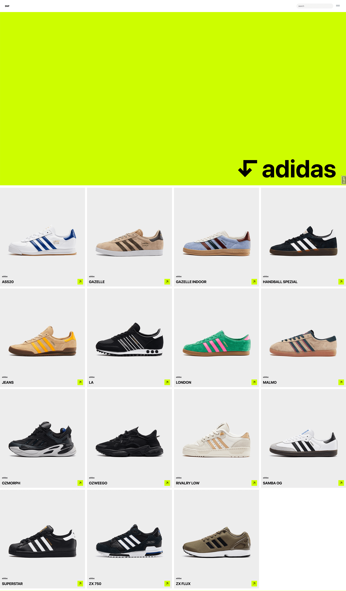

# SneakerPedia

## Overview

Sneakerpedia is a portfolio project built using a 'traditional' Django stack. It serves as a web application to archive and display sneakers and their related information, such as brand, designer, and release year. The project demonstrates core Django skills, including models, views, templates, user authentication, API design and testing.




## Stack
- Django
- Django Rest Framework
- Tailwind
- Alpine JS

## API

The project includes an API, that allows access to sneaker data via a GET request. The docs can be viewed at http://127.0.0.1:8000/api/schema/redoc/ when the project is running.


## Local Development Setup

1.  Clone the repository and navigate into the directory:
    ```shell
    git clone [https://github.com/alexanderpetricca/sneakerpedia](https://github.com/alexanderpetricca/sneakerpedia)
    cd sneakerpedia
    ```

2.  Ensure Docker is installed and running on your system.

3.  Create a `.env` file in the project root to store your environment variables. For development, add the following:
    ```
    SECRET_KEY=your_secret_key_here
    DJANGO_DEBUG=True
    ```
    For production, `DEBUG` should be set to `False`, and you will need to add variables for your database and email provider (see `settings.py` for details).

4.  Build the Docker image and start the containers:
    ```shell
    docker-compose up --build
    ```

5.  In a separate terminal, apply migrations to the database:
    ```shell
    docker-compose exec web python manage.py migrate
    ```

6.  Create a superuser to access the admin panel:
    ```shell
    docker-compose exec web python manage.py createsuperuser
    ```

7.  Navigate to `http://127.0.0.1:8000/` in your browser.

## Seed Data

The project includes a management command to populate the database with initial seed data.

1.  **Download Seed Images:** Download the required sneaker images.
2.  **Place Images:** Unzip and place the images into the `media/seed_images/` directory at the project root.
3.  **Run Seed Script:** Execute the following command to run the seed script. This will populate the brands and sneakers from the provided CSV file and link them to the images.
    ```shell
    $ docker-compose exec web python manage.py seed_data
    ```

## Tests

To run the test suite:

```shell
$ docker-compose exec web python manage.py test
```